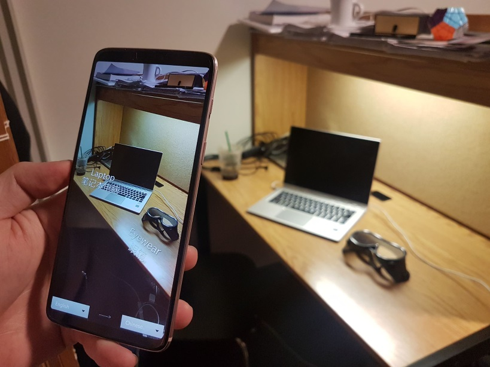
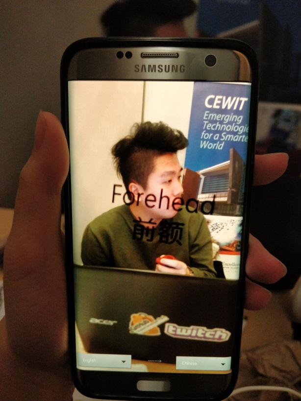

What is This Thing?
==================
Sometimes you're just too lazy to type in what you're looking at.\
Sometimes what an object is called slips your mind.\
Sometimes it's both.

Tap an object on screen to display the object's name in two languages. Uses ARCore to place text relative to the physical world. Translations are cached on DynamoDB to reduce Google Translate API calls and processing time. Object snapshots are passed to Google Cloud Vision to determine most-likely matches.

**Authors**: [@cxyStephen](https://github.com/cyxStephen), [@aandycen](https://github.com/aandycen), [@JunheZhang66](https://github.com/junhezhang66), and [@mengtliu1998](https://github.com/mengtliu1998)

* * *
#### Built using
* **ARCore Sceneform** 1.7.0
* **Cloud Vision** v1 rev415-1.25
* **AWS SDK for Android** 2.7
* **Google Translate (REST API)** v2

*Requires [ARCore by Google](https://developers.google.com/ar/discover/supported-devices) compatibility and Android Nougat 7.0 (API level 24).*

* * *
#### Demo

* * *
*Built using Android Studio 3.3. Tested on OxygenOS 9.0.4 (Android 9.0) and Samsung Experience 9.0 (Android 8.0).* \
*API keys are now defunct, replace them with your own if you wish to build.*
